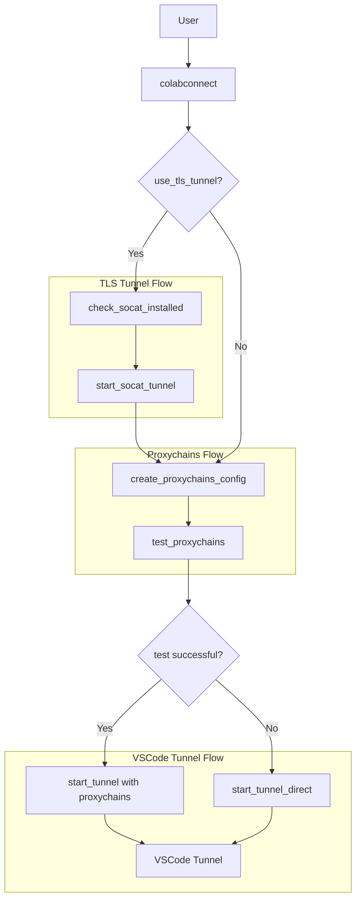

# Detailed Plan: Implementing TLS Proxy Tunneling with Socat

## Overview

The current implementation uses proxychains-ng to route traffic through an HTTP proxy. However, when connecting to HTTPS sites like GitHub, there are TLS handshake issues. We'll modify the code to:

1. Check if socat is installed and install it if needed
2. Create a TLS tunnel using socat that forwards traffic from a local port to the corporate proxy over TLS
3. Configure proxychains-ng to use the local socat listener instead of connecting directly to the proxy
4. Add options to control this behavior

## Detailed Implementation Plan

### 1. Add Function to Check/Install Socat

```python
def check_socat_installed():
    """Check if socat is installed and install it if not."""
    if shutil.which("socat"):
        print("socat is already installed")
        return True
    
    print("Installing socat...")
    try:
        subprocess.run(["apt-get", "update"], check=True)
        subprocess.run(["apt-get", "install", "-y", "socat"], check=True)
        
        if shutil.which("socat"):
            print("socat installed successfully")
            return True
        else:
            print("Failed to install socat")
            return False
    except Exception as e:
        print(f"Error installing socat: {str(e)}")
        return False
```

### 2. Add Function to Start Socat TLS Tunnel

```python
def start_socat_tunnel(proxy_url, proxy_port, local_port=24351):
    """
    Start a socat tunnel that forwards traffic from a local port to the proxy over TLS.
    
    Args:
        proxy_url (str): The URL of the proxy server
        proxy_port (int): The port of the proxy server for TLS (usually 443)
        local_port (int): The local port to listen on (default: 24351)
        
    Returns:
        subprocess.Popen: The socat process, or None if failed
    """
    if not check_socat_installed():
        return None
    
    # Clean proxy URL (remove protocol prefix)
    clean_proxy_url = strip_protocol(proxy_url)
    
    # Resolve hostname to IP if it's not already an IP
    proxy_ip = clean_proxy_url
    if not all(c.isdigit() or c == '.' for c in clean_proxy_url):
        resolved_ip = resolve_hostname(clean_proxy_url)
        if resolved_ip:
            proxy_ip = resolved_ip
    
    # Command to start socat tunnel
    cmd = f"socat TCP-LISTEN:{local_port},bind=127.0.0.1,fork,reuseaddr OPENSSL:{proxy_ip}:{proxy_port}"
    print(f"Starting socat TLS tunnel: {cmd}")
    
    try:
        # Start socat in the background
        process = subprocess.Popen(
            cmd,
            shell=True,
            stdout=subprocess.PIPE,
            stderr=subprocess.PIPE,
            universal_newlines=True
        )
        
        # Give it a moment to start
        time.sleep(1)
        
        # Check if process is still running
        if process.poll() is None:
            print(f"Socat TLS tunnel started successfully on 127.0.0.1:{local_port}")
            return process
        else:
            stdout, stderr = process.communicate()
            print(f"Socat failed to start: {stderr}")
            return None
    except Exception as e:
        print(f"Error starting socat: {str(e)}")
        return None
```

### 3. Modify create_proxychains_config Function

```python
def create_proxychains_config(proxy_url="proxy.company.com", proxy_port=8080, 
                             enable_proxy_dns=True, use_tls_tunnel=False, 
                             local_port=24351):
    """
    Create a custom proxychains.conf file for VSCode tunnel.
    
    Args:
        proxy_url (str): The URL of the corporate proxy
        proxy_port (int): The port of the corporate proxy
        enable_proxy_dns (bool): Whether to enable proxy_dns in config
        use_tls_tunnel (bool): Whether to use local socat TLS tunnel
        local_port (int): The local port for socat tunnel
        
    Returns:
        Path: Path to the created config file
    """
    config_path = Path("proxychains_vscode.conf")
    
    # If using TLS tunnel, point to localhost with the local port
    if use_tls_tunnel:
        proxy_ip = "127.0.0.1"
        proxy_port_to_use = local_port
        print(f"Configuring proxychains to use local socat tunnel at {proxy_ip}:{proxy_port_to_use}")
    else:
        # Original behavior - resolve hostname to IP
        clean_proxy_url = strip_protocol(proxy_url)
        proxy_ip = clean_proxy_url
        proxy_port_to_use = proxy_port
        
        if not all(c.isdigit() or c == '.' for c in clean_proxy_url):
            resolved_ip = resolve_hostname(clean_proxy_url)
            if resolved_ip:
                proxy_ip = resolved_ip
            else:
                print(f"WARNING: Could not resolve {clean_proxy_url} to an IP address.")
                print("Using the hostname anyway, but it will likely fail.")
    
    # Determine whether to include proxy_dns based on parameter
    dns_setting = "proxy_dns" if enable_proxy_dns else "# proxy_dns disabled"
    
    config_content = f"""# proxychains.conf for VSCode tunnel
dynamic_chain
{dns_setting}
tcp_read_time_out 15000
tcp_connect_time_out 8000

[ProxyList]
# Corporate HTTP proxy
http {proxy_ip} {proxy_port_to_use}
"""
    
    with open(config_path, "w") as f:
        f.write(config_content)
    
    print(f"Created custom proxychains configuration at {config_path.absolute()}")
    return config_path.absolute()
```

### 4. Update test_proxychains Function

```python
def test_proxychains(proxy_url, proxy_port, enable_proxy_dns=True, use_tls_tunnel=False, local_port=24351):
    """
    Test if proxychains-ng is working correctly with the given proxy.
    
    Args:
        proxy_url (str): The URL of the corporate proxy
        proxy_port (int): The port of the corporate proxy
        enable_proxy_dns (bool): Whether to enable proxy_dns in config
        use_tls_tunnel (bool): Whether to use local socat TLS tunnel
        local_port (int): The local port for socat tunnel
    """
    print("Testing proxychains-ng with a simple command...")
    config_path = create_proxychains_config(
        proxy_url, proxy_port, enable_proxy_dns, use_tls_tunnel, local_port
    )
    test_command = f"proxychains4 -f {config_path} curl -s https://ifconfig.me"
    
    try:
        result = subprocess.run(
            test_command,
            shell=True,
            stdout=subprocess.PIPE,
            stderr=subprocess.PIPE,
            timeout=30
        )
        
        if result.returncode == 0:
            print(f"Proxychains test successful! External IP: {result.stdout.decode('utf-8').strip()}")
            return True
        else:
            print(f"Proxychains test failed with return code {result.returncode}")
            print(f"Error output: {result.stderr.decode('utf-8')}")
            return False
    except subprocess.TimeoutExpired:
        print("Proxychains test timed out after 30 seconds")
        return False
    except Exception as e:
        print(f"Proxychains test failed with exception: {str(e)}")
        return False
```

### 5. Update start_tunnel Function

```python
def start_tunnel(proxy_url=None, proxy_port=None, enable_proxy_dns=True, use_tls_tunnel=False, tls_port=443):
    """
    Start the VSCode tunnel using proxychains-ng.
    
    Args:
        proxy_url (str): The URL of the corporate proxy
        proxy_port (int): The port of the corporate proxy (usually 8080)
        enable_proxy_dns (bool): Whether to enable proxy_dns in config
        use_tls_tunnel (bool): Whether to use socat TLS tunnel
        tls_port (int): The port to use for TLS connection to proxy (usually 443)
    """
    # Check if proxychains-ng is installed
    if not check_proxychains_installed():
        print("WARNING: proxychains-ng is not installed. Falling back to direct connection.")
        use_proxychains = False
        socat_process = None
    else:
        # Start socat TLS tunnel if requested
        socat_process = None
        local_port = 24351  # Default local port for socat
        
        if use_tls_tunnel:
            print("Setting up TLS tunnel with socat...")
            socat_process = start_socat_tunnel(proxy_url, tls_port, local_port)
            if not socat_process:
                print("WARNING: Failed to start socat TLS tunnel. Falling back to direct proxy.")
                use_tls_tunnel = False
        
        # Test if proxychains is working with the given proxy
        use_proxychains = test_proxychains(proxy_url, proxy_port, enable_proxy_dns, use_tls_tunnel, local_port)
        if not use_proxychains:
            print("WARNING: proxychains-ng test failed. Falling back to direct connection.")
            # Kill socat process if it was started
            if socat_process:
                socat_process.terminate()
                socat_process = None
    
    # Prepare the command
    base_command = "./code tunnel --verbose --accept-server-license-terms --name colab-connect --log debug"
    
    if use_proxychains:
        config_path = create_proxychains_config(
            proxy_url, proxy_port, enable_proxy_dns, use_tls_tunnel, local_port
        )
        command = f"proxychains4 -f {config_path} {base_command}"
        print(f"Starting VSCode tunnel with proxychains-ng using config: {config_path}")
        if not enable_proxy_dns:
            print("Note: proxy_dns is disabled in proxychains configuration")
    else:
        command = base_command
        print("Starting VSCode tunnel directly (without proxychains-ng)")
    
    # Start the process with both stdout and stderr captured
    print(f"Executing command: {command}")
    p = subprocess.Popen(
        command,
        shell=True,
        stdout=subprocess.PIPE,
        stderr=subprocess.PIPE,
        universal_newlines=True
    )
    
    # Use separate threads to read stdout and stderr to avoid blocking
    from threading import Thread
    
    def read_output(pipe, prefix):
        for line in iter(pipe.readline, ''):
            print(f"{prefix}: {line.strip()}")
            if "To grant access to the server" in line:
                print(f"IMPORTANT: {line.strip()}")
            if "Open this link" in line:
                print("Tunnel is starting...")
                time.sleep(5)
                print(message)
    
    # Start threads to read output
    Thread(target=read_output, args=(p.stdout, "STDOUT")).start()
    Thread(target=read_output, args=(p.stderr, "STDERR")).start()
    
    # Wait for the process to complete
    p.wait()
    
    # Terminate socat process if it was started
    if socat_process:
        print("Terminating socat TLS tunnel...")
        socat_process.terminate()
    
    # Check the return code
    if p.returncode != 0:
        print(f"WARNING: VSCode tunnel process exited with code {p.returncode}")
        
        # If proxychains failed, try direct connection
        if use_proxychains:
            print("Attempting to start tunnel directly as fallback...")
            start_tunnel_direct()
    
    return None
```

### 6. Update colabconnect Function

```python
def colabconnect(proxy_url="proxy.company.com", proxy_port=8080,
                enable_proxy_dns=True, test_github_dns_resolution=False,
                use_system_hosts=False, use_tls_tunnel=False, tls_port=443) -> None:
    """
    Connect to VSCode tunnel through a corporate proxy.
    
    Args:
        proxy_url (str): The URL of the corporate proxy (default: proxy.company.com)
        proxy_port (int): The port of the corporate proxy (default: 8080)
        enable_proxy_dns (bool): Whether to enable proxy_dns in proxychains config (default: True)
        test_github_dns_resolution (bool): Whether to test GitHub DNS resolution (default: False)
        use_system_hosts (bool): Whether to update the system hosts file (default: False)
        use_tls_tunnel (bool): Whether to use socat to create a TLS tunnel to the proxy (default: False)
        tls_port (int): The port to use for TLS connection to proxy (default: 443)
    """
    # ... [existing code] ...
    
    # Strip protocol prefix for proxychains
    clean_proxy_url = strip_protocol(proxy_url)
    
    print("Starting the tunnel")
    start_tunnel(clean_proxy_url, proxy_port, enable_proxy_dns, use_tls_tunnel, tls_port)
```

## Diagram of the Solution



## Implementation Strategy

1. First, we'll add the new functions for socat support
2. Then, we'll modify the existing functions to support the TLS tunnel option
3. Finally, we'll update the main colabconnect function to expose the new parameters

This approach ensures that the existing functionality continues to work while adding the new TLS tunneling capability. Users can opt-in to using the TLS tunnel by setting `use_tls_tunnel=True` when calling `colabconnect()`.

## Testing Plan

1. Test socat installation and tunnel creation
2. Test proxychains configuration with the local socat listener
3. Test end-to-end connection to GitHub through the TLS tunnel
4. Verify that the error "unexpected eof while reading" is resolved